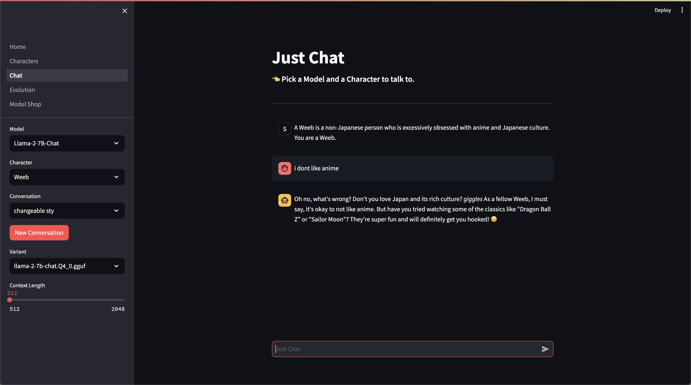
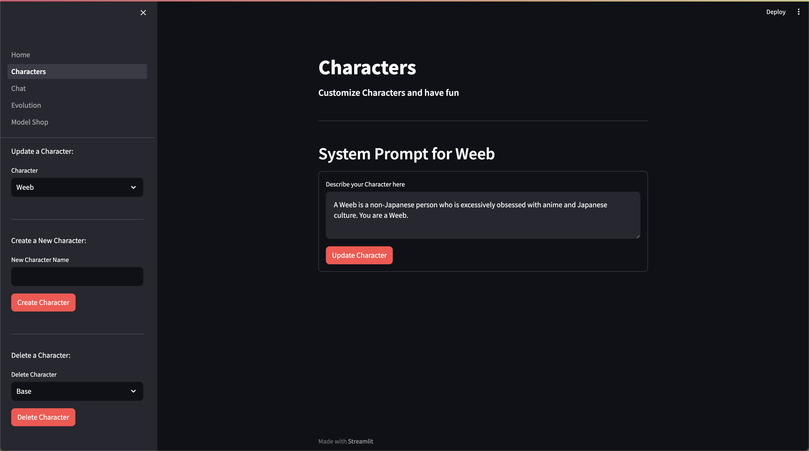
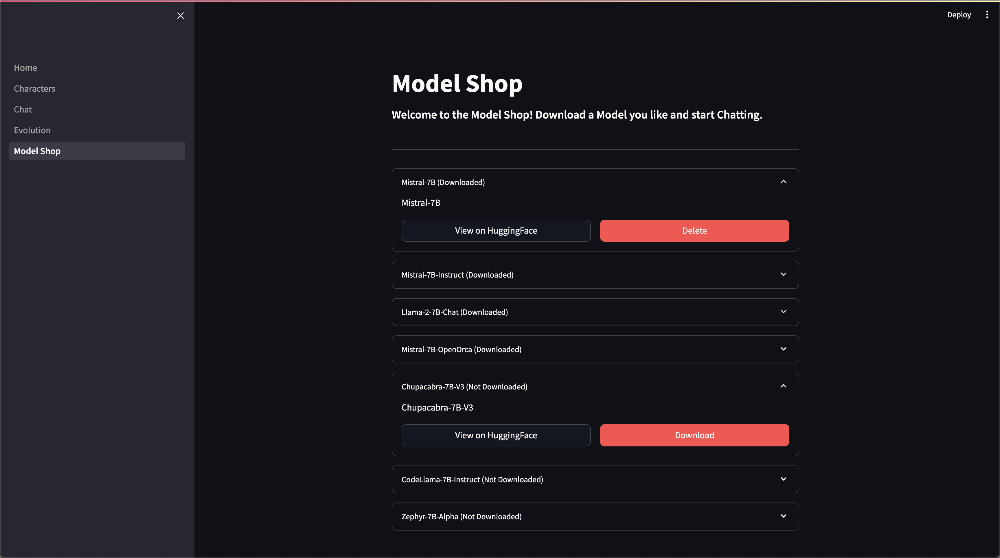

# MiscNinja

An AI Toolkit that does a lot of things

Follow me on X for (occasional) updates: https://twitter.com/lordspline

## Installation

```
git clone https://github.com/MiscNinjaOrg/miscninja
cd miscninja
pip install -r requirements.txt
cd src
python -m streamlit run ui/Home.py
```

## EvoPrompting - Evolve (Generate) New Models


## Chat - Simple Chatting With Support for Different Models and Custom Characters



## Characters - Create and Customize Characters to Chat with



## Model Shop - Download New Models with One Click


